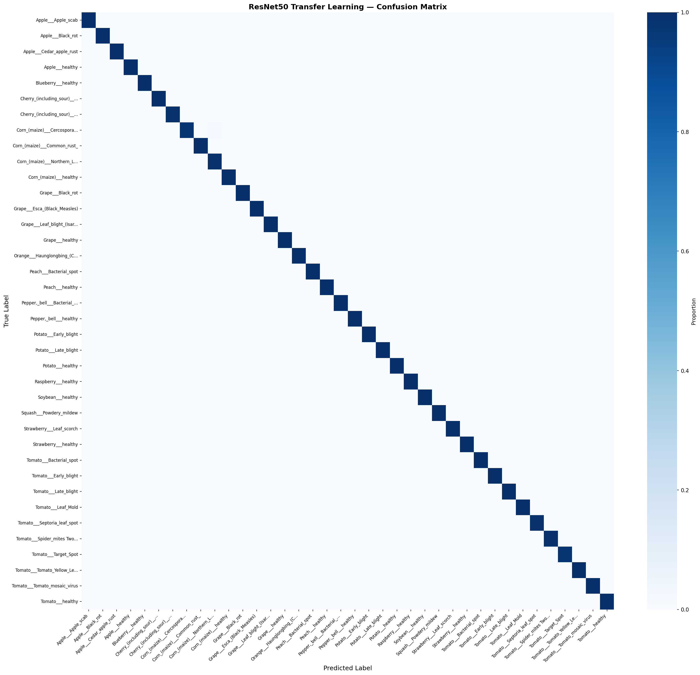
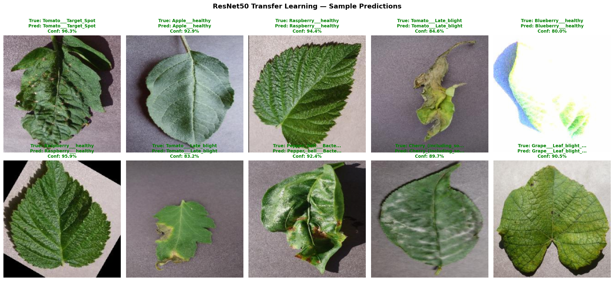
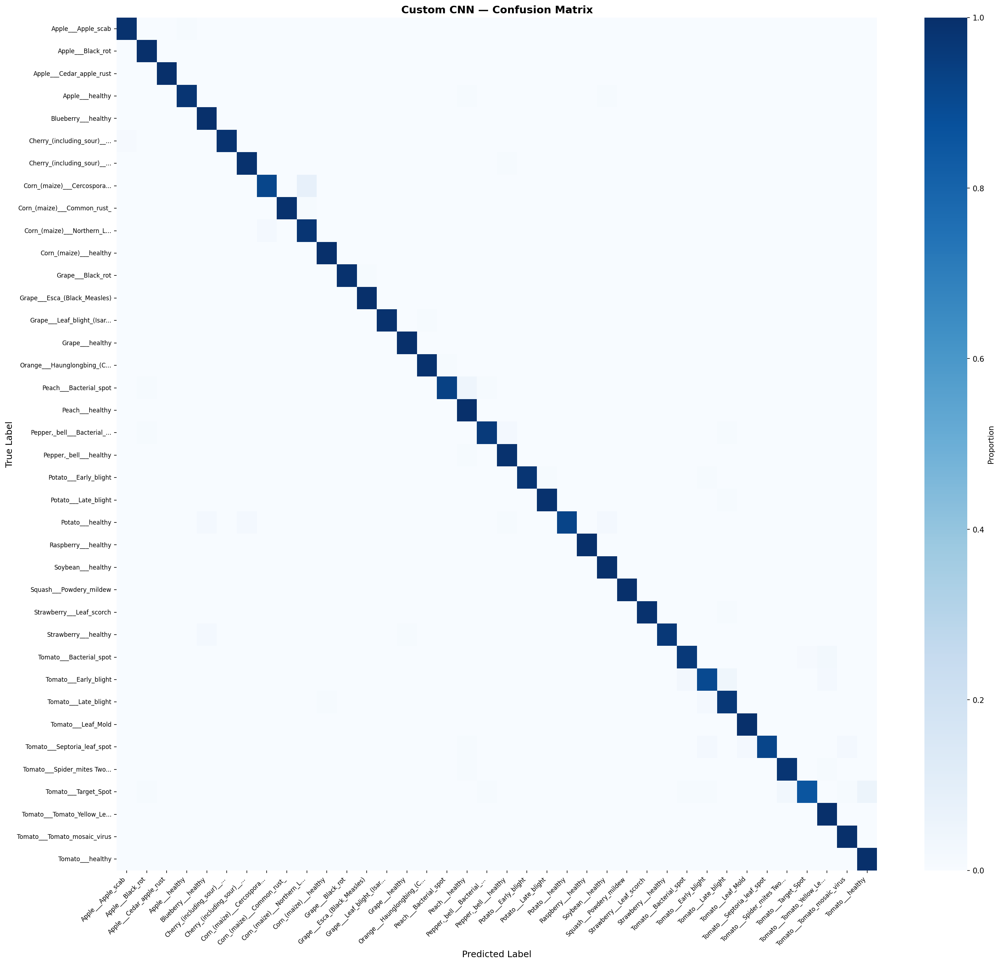
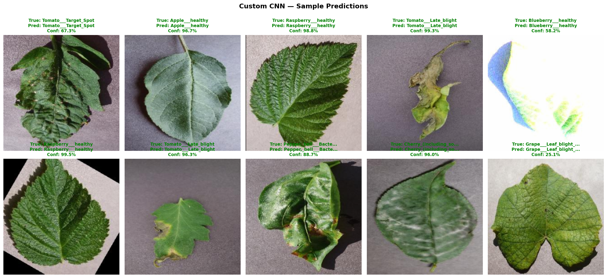

# PlantHealth AI — Evaluation Report

## Model Evaluation Summary

This report presents the evaluation results for both the Custom CNN baseline
and the ResNet50 Transfer Learning model on the PlantVillage test set.

---

## Model Comparison

| Metric | Custom CNN | ResNet50 (Transfer) |
|--------|-----------|--------------------|
| Accuracy | 97.72% | 99.77% |
| Top5 Accuracy | 99.97% | 100.00% |
| Macro Precision | 0.9779 | 0.9977 |
| Macro Recall | 0.9768 | 0.9976 |
| Macro F1 | 0.9769 | 0.9976 |
| Weighted F1 | 0.9770 | 0.9977 |

---

## ResNet50 Transfer Learning — Detailed Results

- **Overall Accuracy**: 99.77%
- **Top-5 Accuracy**: 100.00%
- **Macro F1-Score**: 0.9976
- **Weighted F1-Score**: 0.9977

### Confusion Matrix

### Sample Predictions

A grid of 10 random test images showing the true label, predicted label, and confidence.

---

## Custom CNN — Detailed Results

- **Overall Accuracy**: 97.72%
- **Top-5 Accuracy**: 99.97%
- **Macro F1-Score**: 0.9769
- **Weighted F1-Score**: 0.9770

### Confusion Matrix

### Sample Predictions

---

## Conclusion

Transfer Learning with ResNet50 outperforms the Custom CNN by **2.06%** in overall accuracy. This demonstrates the power of leveraging pre-trained features from ImageNet for a specialized task like plant disease classification.

The ResNet50 model is recommended for production deployment due to its superior accuracy and generalization capabilities.
